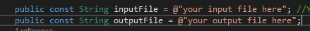

# Kahoot Maker
This is a script I developed to aid in the creation of kahoots.

## System Requirements

###You will need
	-Excel (or other .xlsx file editing software)
	- A text editor
	-.net Development tools
	- A copy of the kahoot spreadsheet template
###Things you might need idk (maybe optional)
	- A word processor
	- Visual Studio VSCode, or a IDE to run C# code
	- Git Bash

## Getting Started
###Getting the Code on Your Computer
To get started with the code, you will have to clone it so that it exists on your computer. Or you can download it with the code button

###Setting up the Environment

You will have to edit this code. It is not a difficult edit, but an edit nonetheless. 
The two lines you have to edit are the top two const Strings (lines 7 and 8).

Keep the @ symbol so that the string remains a literal and you don't have to search for the \ escape code

###Preparing your questions
The questions you provide have to be in an **_Extremly_** specific format. This format is:

	QuestionText
	[question answer]
	'space'
You do **not** write space, but there needs to be a line between each question and answer. 
#####Important Note: The questions can only contain one answer.
###Preparing your files
You must make ```.txt ``` files. The program cannot deal with non ```.txt``` files.
Name these something meaningful. I named mine kahootIn and kahootOut.
Probably the best ways to make questions are to prepare them in a more complex word processor, ie word, and then copy into a ```.txt``` file.
###Changing the Default List Separator.
This is the hardest part of setting everything up. It will not break your computer outright but make sure to change it back when your done.

Step 1. Navigate to ```Control Panel --> Clock and Region ---> Region --> Additional Settings ```
Step 2. Change ```List Separator``` from a ```,``` to a ```|```. I dont see this affecting system functions but if you are concerned, then change it back when you are done.
##Running the code.
This is the easiest step. Run the code, and your output shall be saved.
##The complicated part
This is the hardest part.
Now you have to change the files extension of your ```.txt``` file to a ```.csv``` file. This won't break the file, as ```.csv``` files are not obfuscated in any way.
Open this file with excel.
Use excel to save this file as a ```.xlsx``` file.
In excel change the font of the table to ```Montesserat``` and font size to ```12``` **_THIS IS IMPORTANT_**
Now open the Kahoot quiz template you got from kahoot's website.
Copy the table ( minus the question numbers) into the file.
Save and Submit!

###Questions or Concerns?
Contact me on discord @Sprite Cranberry#2365


